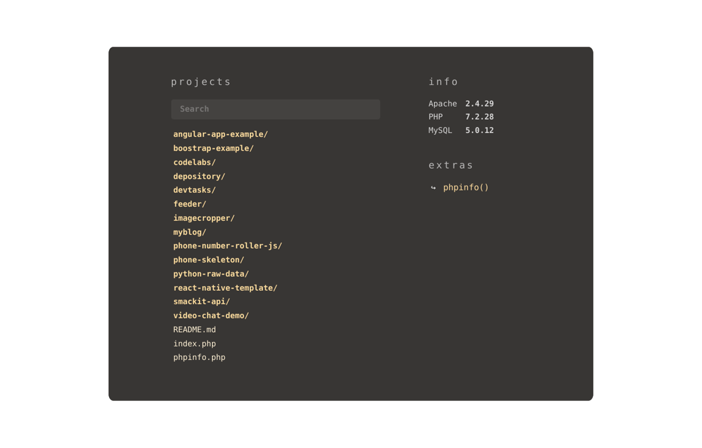

# Modern Localhost
Modern Localhost is a beautified version of your typical localhost index page.



## Install
Download this repo and extract `index.php` to your `www` folder, or whatever is your server's root. You can also replace your webserver's default index page to it.

## Configuration
You can edit the `$options` array at the top of the `index.php` to customize it your needs.
```php
...
$options = [
    /**
     * Set the theme
     * Available themes: bluey, pinky, purply
    */
    'theme' => 'grayish',

    /**
     * Exclude files or folders
     * use wildcard pattern. eg: ['.git*', '*.exe', '*.sh']
    */
    'exclude' => [ ],

    /**
     * Add extra tools 
     * [label] => '[link of the tool]
     * eg: 'phpMyAdmin' => 'http://localhost/phpMyAdmin'
    */
    'extras' => [
	    'phpinfo()' => '?phpinfo=1'
    ]
];
...
```

#### Themes
Available values for the `theme` are: `grayish` `bluey` `pinky` `purply`

#### Excluding Files/Folders
You can tell it to exclude certain files and folders. For example to tell it to exclude all the `.exe` files you can specify:
```php
...
  'exclude' => [
    '*.exe'
  ],
...
```
To exclude multiple files and folders:
```php
...
  'exclude' => [
    '*.exe', '*.git', `*.sh', 'config/*'
  ],
...
```

## Support
This project is targeted for so-called LAMP environments (Linux, Apache, MySQL and PHP). Also equally supports MAMP and WAMP. Other environments can also be supported but with a little bit of tweak.

## License
Copyright (C) 2020 Mohamed Adhuham <me@adhuham.com>

This program is free software: you can redistribute it and/or modify
it under the terms of the GNU General Public License as published by
the Free Software Foundation, either version 3 of the License, or
(at your option) any later version.

This program is distributed in the hope that it will be useful,
but WITHOUT ANY WARRANTY; without even the implied warranty of
MERCHANTABILITY or FITNESS FOR A PARTICULAR PURPOSE.  See the
GNU General Public License for more details.

You should have received a copy of the GNU General Public License
along with this program.  If not, see <https://www.gnu.org/licenses/>.
